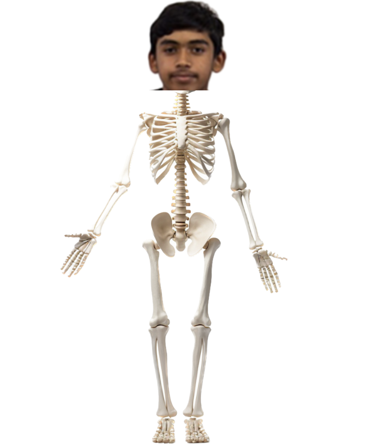

### Game Objectives:
The level starts by Rachit going to Disneyland, Finding a small kid pulling out the sword in the stone. Then he trys pulling the sword but it wouldn't move AT ALL. This motivates him to become buffed and come back to pull out the sword. 

The strength that he needs in order to pass the game is 800 lb worth full body pulling strength.

### Game Characters: 
#### - Rachit (Before Buffed)
Basic idea of Rachit before getting buffed:

#### - Rachit (Buffed)
Basic idea/picure of  buffed Rachit, might be developed over time :

### Background:
##### There are two settings in the level, Disneyland and the Gym.
#### Gym 
Gym is for Rachit to become buffed by using benchpress, deadlifts and other weights. 
Rachit would get buffed here: 

#### Disneyland(Sword in the Stone)
After, there is a button, transporting Rachit to Disneyland to check if he has enough strength, if he doesn't, there would be a sign saying how he needs more strength, and if he has enough strength, it would let him go to the next stage.
Rachit would attempt to pull out the sword here:

### Game plan (Flowchart)
